# MaSpeQC
An easy-to-use interactive pipeline to assess the performance of LC-MS/MS instrumentation.  
Suitable for proteomics, metabolomics and lipidomics workflows.  

Check out the demo version <a href="https://analyst-suites.org/apps/qc-demo/" target="_blank" rel="noopener noreferrer">here</a>
  
  
  
  

Use the menu  at the top of this README for quick navigation.

## Installation on Windows
To install MaSpeQC on any _Windows_ system, download and unzip the latest release from the link below, then simply run the script ___start_maspeqc_setup.bat___ as administrator from the command line. This will install all of the necessary software and dependencies to use MaSpeQC. 

<a href="https://github.com/MonashProteomics/MaSpeQC/archive/refs/tags/1.0.2.zip">MaSpeQC Zip Download</a>

## Installation on Linux or MacOS
To install MaSpeQC on any _Linux_ or _MacOS_ system, download and unzip the latest release from the link below. 

<a href="https://github.com/MonashProteomics/MaSpeQC/archive/refs/tags/1.0.2.tar.gz">MaSpeQC Tar Download</a>

Then add the following software into a directory named _Software_ in the main directory. 

- __Proteowizard:__ https://proteowizard.sourceforge.io/doc_users.html
	- Follow the download instructions for Linux or MacOS
- __MZmine 2.53:__ https://github.com/mzmine/mzmine2/releases/tag/v2.53
- __Morpheus (mzML):__ https://cwenger.github.io/Morpheus/
- __MySQL 5.7.41:__ https://downloads.mysql.com/archives/community/
	- Select Product Version 5.7.41
- __Node.js 18.20.4 (LTS):__ https://nodejs.org/en/download/package-manager
	- Select 'Prebuilt Installer' for MacOS
 	- Select 'Package Manager' or 'Prebuilt Binaries' for Linux
- __Python:__ https://www.python.org/downloads/
	- Select a 3.11 release
   
 The desired folder structure is:

 ```
├── MaSpeQC-main
│	├── mpmf-pipeline
│	├── mpmf-server
│	├── Software
│	│   ├── Morpheus (mzML)
│	│   ├── mysql-5.7.41
│	│   ├── MZmine-2.53
│	│   ├── node-v18.20.4
│	│   ├── ProteoWizard
│	│   ├── Python
```

Next, navigate to the _mpmf-pipeline_ directory and create the Python environemnt from the _requirements.txt_ file.
Finally, set-up the node.js server by runnining `npm install` from the _mpmf-server_ directory. 

You can now configure MaSpeQC by running `npm start --setup` and opening a browser window at _http://localhost/configuration_.

## Additional Installation Instructions for Thermo Fisher Scientific Instruments Only
In order to process the pressure metrics and profiles which are a feature for Thermo Fisher Scientific instruments, the standard libraries for raw file access provided by Thermo Fisher Scientific <a href="https://github.com/thermofisherlsms/RawFileReader/">here</a> need to be included in MaSpeQC.  
  
Firstly, download the available libraries as a zip file from <a href="https://github.com/thermofisherlsms/RawFileReader/archive/refs/heads/main.zip">here</a>, extract the zip file, and read the license.  

Then, navigate to the folder (`Libs/Net471`, `Libs/NetCore/Net5` or `Libs/NetCore/Net8`) for the .NET environment (`.NET Framework` or `.NET Core`) that is installed on the system and copy the 4 _ThermoFisher_ dll files to the __mpmf-pipeline__ folder in MaSpeQC. On most systems `.NET Framework` or `.NET Core` are installed by default, and `.NET Core` is backward compatible to `.NET Framework`. Thus it is very likely that the dll files from `Libs/Net471` work on your system.  

The 4 files that are required are named:
- ThermoFisher.CommonCore.BackgroundSubtraction.dll
- ThermoFisher.CommonCore.Data.dll
- ThermoFisher.CommonCore.MassPrecisionEstimator.dll
- ThermoFisher.CommonCore.RawFileReader.dll

Finally, you need to unblock the files for use on Windows machines. Right mouse click on each file in Windows Explorer, select _Properties_ and check `Unblock` (see image below).  
  
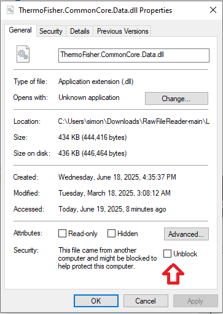


## Configuration
Before using MaSpeQC, it is necessary to fill in a configuration form. The configuration process is triggered automatically during Windows installation and can be initiated manually as shown above for Linux and MacOS. The following inputs are required to configure the system:

- #### INSTRUMENTS : The LC-MS/MS instruments the system will monitor.
	- _Instrument Name_ (Unique, No Spaces)
	- _Instrument Type_ (Thermo Scientific, Agilient, Bruker, Sciex, Waters)

	__NOTE:__ To use MaSpeQC on _mzML_ files directly, choose _Instrument Type_ as _Other_.
- #### INPUT COMPONENTS : The QC input sample information.
	- _Component Name_ (Unique, No Spaces)
	- _Expected mz value_
	- _Expected Retention Time_ (Minutes)
	- _Polarity_ (Positive/Negative, Metabolomics/Lipidomics Only)

	__NOTE__: A maximum of 15 input components is allowed per QC sample (for metabolomics, this is 15 of each polarity)

- #### THRESHOLDS: The settings to use for warning thresholds.


- #### CONTACTS: The details of the contacts to inform when QC performance thresholds are not met.
	- _Contact Name_
	- _Contatct Email_
- #### INPUT FOLDER: The location of the directories that store the raw files for processing.
	- An absolute path for the top-level storage location of raw files. See [File Formats and Directory Structure](#file-formats-and-directory-structure) for the required subfolder structure.
- #### OUTPUT FOLDER: Storage for the outputs of the processing.
  	- An absolute path for the top-level storage location of the output files generated during processing. 
- #### EMAIL INFO: The details of the email account to use.
	- _Port_ (eg. 465)
	- _SMTP Server_ (eg. smtp.gmail.com)
	- _Email Sender_ (eg. maspeqc.user@gmail.com)
	- _Email Password_

## Running the Database Server

#### On Windows
To start the database for MaSpeQC, open a console window, navigate to _/Software/mysql-5.7.41-winx64/bin_ and type:
- `mysqld`

Leave this window open when using MaSpeQC. It is also possible to run the MySQL database server as a service making it available without manual activation. 
For more information see https://dev.mysql.com/doc/refman/8.4/en/windows-start-service.html

#### On Linux and MacOS
Consult the MySQL documentation for instructions on starting a database server for your system.  
https://dev.mysql.com/doc/mysql-getting-started/en/#mysql-getting-started-installing

## File Formats and Directory Structure
The raw QC input files are required to be stored in __instrument_name__ (defined in configuration) folders in the input folder specified during configuration.
 ```
├── Input Folder
│   ├── instrument_name_1
│   ├── instrument_name_2
│   ├── instrument_name_3
│   ├── instrument_name_4
│   ├── instrument_name_5
```
For example, if there is an instrument named 'exploris', the raw files need to be stored in a folder named 'exploris' that is a subfolder of the top level input folder. 

The required format for input file names is:
- QC_Metabolomics_TIMESTAMP.vendor
- QC_Proteomics_TIMESTAMP.vendor

Where,
- __TIMESTAMP__ = YYYYMMDDHHMMSS or YYYYMMDDHHMM
	- The Timestamp defines the time of the QC run. 
- __vendor__ is the vendor file format of the machine (.raw, .wiff, .d, .mzML)

## Processing Raw Files
Make sure the database has been activated, then open a console window, navigate to  _/mpmf-pipeline/.venv/Scripts_ and type `activate.bat`.  
  
This will activate the Python environment needed to process raw files. QC runs can now be triggered from the _/mpmf-pipeline_ directory with the command `python MPMF_Process_Raw_Files.py` and the following __3 arguments__:  
- EXPERIMENT TYPE: metabolomics/proteomics
- NUMBER OF RUNS: The number of most recent runs to process (-1 equals process all).
- EMAIL ALERT: Y/N for whether to send notification emails or not.
  
eg. `python MPMF_Process_Raw_Files.py "metabolomics" "10" "Y"`  
eg. `python MPMF_Process_Raw_Files.py "proteomics" "-1" "N"`

## Starting MaSpeQC
After 5 QC runs have been processed for a machine, it is available for viewing in MaSpeQC. To start using MaSpeQC:
- Open a console window, navigate to the __mpmf-server__ directory.
- Type `npm start`
- Open a browser window at your _localhost_ to start using MaSpeQC
- __NOTE__: An attempt will be made to establish a _https_ connection, however if this fails a _http_ connection is established. Modify the location of certificate/key in the _www_ file to establish a _https_ connection.


## FASTA database (Proteomics only)
The Morpheus search algorithm for MS/MS data which is used during the processing of proteomics QC files requires a FASTA proteome database.
The database file needs to be named _CUSTOM.fasta_ and added to MaSpeQC in the following folder:

- `\MaSpecQC-main\Software\Morpheus (mzML)`

FASTA databases are available from many sources including <a href="https://www.uniprot.org/">UniProt</a>.

## Metric Definitions

### Identification-free Metrics
- __Mass Error (ppm)__: A measure of instrument accuracy in parts-per-million.
- __Mass Error (mDa)__: A measure of instrument accuracy in milli-Daltons.
- __Retention Time__: Chromatographic elution times of the input compounds.
- __Full Width Half Maximum__: Measure of chromatographic peak width, defined as the width of the peak at half of the peak height.
- __Area (normalised)__: Area of chromatographic peak normalized by the log median values.
- __Height (normalised)__: Height of chromatographic peak normalized by the log median values.
- __Tailing__: A measure of skewness of a chromatographic peak.
- __Asymmetry__: A measure of skewness of a chromatographic peak.

### Identification-based Metrics (Proteomics Only)

- __MS/MS Spectra__: The total number of ms2 spectra present in the QC run.
- __Target PSMs__: The number of peptide spectrum matches (PSM), i.e. the number of ms2 spectra that are assigned to a peptide sequence.
- __Unique Target Peptides__: The number of identified unique peptide sequences.
- __Target Protein Groups__: The number of identified protein groups.
- __Precursor Mass Error__: The average mass error (in ppm) for all precursor ions.

### Pressure Metrics (Thermo Fisher Scientific Only)
All pressure metrics are derived from the pressure profile displayed in the top right corner of the charts page.
#### Main Pump (Metabolomics/Lipidomics Only)
- __Max Pressure__: Maximum recorded pressure during the run.
- __RT at Max Pressure__: Retention time of the maximum pressure.
- __Starting Pressure__: Median pressure during the first minute.
- __End Pressure__: Median pressure during the last minute.

#### Loading Pump (Proteomics Only)
- __Starting Back Pressure__: Average pressure during the first x minutes (x is set in configuration).
- __End Pressure__: Average pressure during the last x minutes (x is set in configuration).
- __Pressure Differential__: Pressure difference between the first and last minute of the gradient.
- __Air Injection__: Difference between the first reading and maximal reading during the initial 30 seconds of the gradient. Can be used to gauge whether air has been injected.
- __Valve Spike Start__: Max increase (in 10 second windows) during the first x minutes (x is set in configuration).
- __Valve Spike End__: Max increase (in 10 second windows) during the last x minutes (x is set in configuration).

#### Gradient Pump (Proteomics Only)
- __Starting Pressure__: Median pressure during the 2 minutes.
- __Valve Drop__: Difference between Starting Pressure and 1st profile trough.
- __Inline Leak__: Difference between Starting Pressure and 1st peak after the 1st profile trough.
- __Max Pressure__: Maximum recorded pressure during the run.
- __Min Pressure__: Minimum recorded pressure during the run.
- __Pressure Differential__: Pressure difference between the first and last minute of the gradient.

## Threshold Definitions
- Thresholds are set during initial configuration but can be adjusted from the web interface as well. When a threshold is breached, a notification email is sent to the Contacts defined during configuration (NOTE: sending of emails can be controlled during processing).
- Threshold markers also appear in the interface of the system. A triggered threshold appears as a exclamation . When no thresholds are triggered, a run will be accompanied by a . 

#### Thresholds for Identification-free metrics
- A _Trigger_ for an identification-free metric refers to the __number of input components__ that must register outside of the _Upper Threshold_ and _Lower Threshold_ range for a performance breach to be recorded for that metric.
- The _Upper Threshold_ and _Lower Threshold_ range is defined in the units of the metric unless marked as a percentile. Percentile ranges are statistical percentiles based on the full data range.
#### Thresholds for Identification-based metrics (Proteomics Only)
- All thresholds for identification-based metrics are defined in terms of percentiles except for Precursor Mass Error, which is defined in _ppm_.

# Using MaSpeQC
## Controls
All charts can be navigated and updated via the controls and menus. The __date controls__ at the top of the page can be used to switch between quality control runs.  
  
<div style='display:flex;justify-content:center;'>    

</div>
</br>

The __input components__ to the left of the chart area can be used to add/remove inputs from all of the charts. _Hold Ctrl_ when clicking on a component name to view that component individually. An __accordion menu__ is available from the chart controls to change between metrics. This will remain open and can be positioned anywhere on the page.

</br>
</br>
<div style='display:flex;justify-content:center;'>    
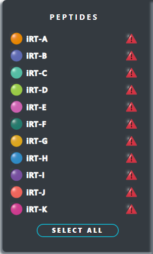
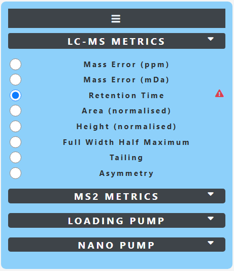
</div>

The chart controls at the top of each chart can be used to change between time scales, and to select the number of runs displayed on a chart (where applicable).  
  
<div style='display:flex;justify-content:center;'>    

</div>  
</br>
</br>
The chart controls at the bottom of each chart can be used to change between the different chart types.  
 </br> 
 </br>
<div style='display:flex;justify-content:center;'>    

</div> 

## Charts

### Summary
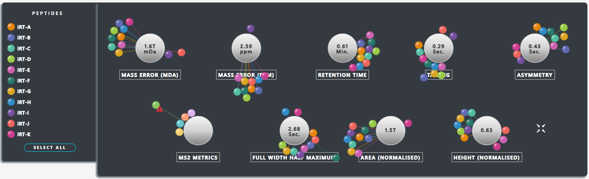  
  
A __network chart__ summarises all identification-free and identification-based metrics and reports the average metric value of the selected input components. 
The length of each edge is determined by how far that input component is from its optimal value. Nodes with optimal readings will rest against their metric node.  

#### User Interaction  
- Hover over an input component node for its reading.
- Click on a metric name (node for MS2 metrics) to jump to the line chart for that metric.
- All nodes can be dragged and moved.
- Click on an input node to highlight it in all metrics. Click again to remove highlight.
- The date controls will animate the summary chart by moving the nodes allowing comparison between runs.  

### Line Charts  
  
  
__Line charts__ show metric values over time for each of the selected input components. Shaded areas represent threshold breaches where applicable.

#### User Interaction 
- The _dashed vertical marker_ is positioned at the currently displayed run.
	- Use the date controls to move the marker between runs.
	- Click on a node to move the marker to that run.
	- Click on the marker itself to focus the chart. The y-axis will expand to highlight that run.
- Change the x-axis by clicking between _Time Scale_ and _Runs Scale_.
- Change the number of displayed runs using the numbered controls.
- Hover over a line to highlight that component.
- Click on a line to focus. The y-axis will expand to highlight that line.
- Hover over a node for its date and reading.
- Click and drag a chart area to focus.
- Double click anywhere to reset the chart.

### Stream Graph  
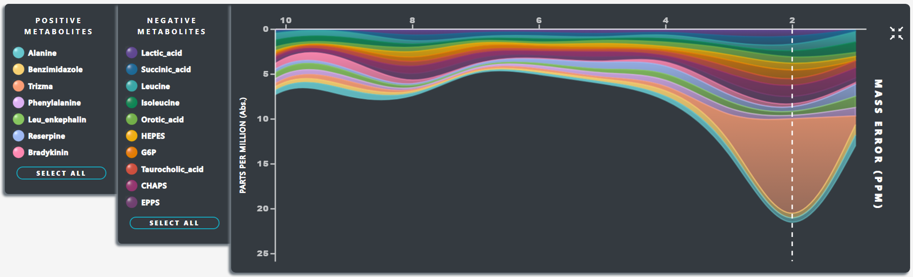
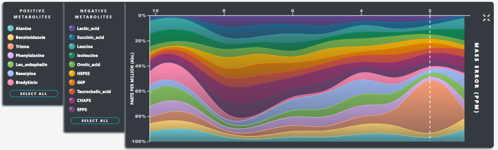  
      
__Stream graphs__ show metric values over time for each of the selected input components. They can be viewed as stacked area charts where the y-axis shows accumulated absolute totals, or as 100% stacked area charts where the y-axis shows the percentage of the total readings.

#### User Interaction 
- The _dashed vertical marker_ is positioned at the currently displayed run.
	- Click on the marker to switch between modes.
	- Hover over the marker to highlight that run.
	- Use the date controls to move the marker between runs.
- Change the x-axis by clicking between Time Scale and Runs Scale.
- Change the number of displayed runs using the numbered controls.
- Hover over a stream to highlight that component.
- Click on a stream to reposition it as the top stream (identification-based metrics only).

### Parallel Graph  
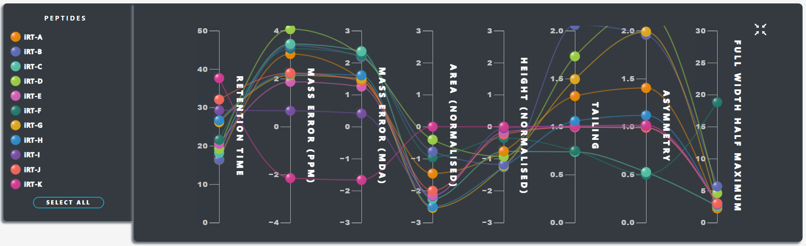  
     
__Parallel graphs__ show all of the metrics (identification-free or identification-based) on the one chart for the selected components. The axes are centered around their optimal values where applicable. 

#### User Interaction
- Use the date controls to move the components to their new readings.
- Click on the axes to focus the input components for that metric. Click again to reset.
- Hover over a line to highlight that component across all metrics.

### Box Plots
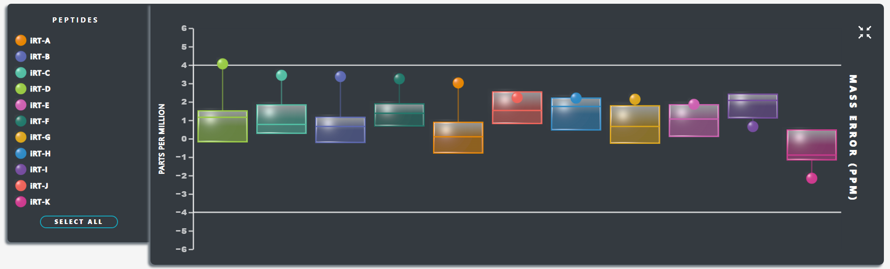  
  
__Box plots__ show a metric value on the display date (circle) in relation to its median and interquartile range. Shaded areas represent threshold breaches where applicable.

#### User Interaction 
- The date controls will transition the circle to its new reading.
- Double click anywhere on the chart to sort the boxes by their current run reading.
- Click a box to focus. The y-axis will expand to highlight that box.
	- Click the box again to reset.
- Hover over a circle for the current run details.
- Hover over a box for the box stats.

### Heat Maps
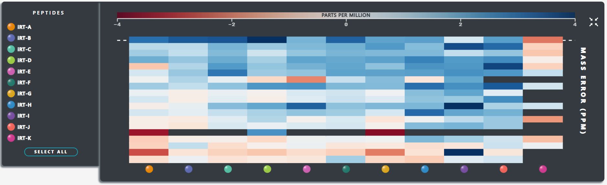  
  
Each column of a __heat map__ shows an individual component over time for that metric, and each row shows an individual QC run.

#### User Interaction
- The _dashed horizontal marker_ is positioned at the currently displayed run.
	- Use the date controls to move the marker between runs.
- Hover over a cell for details.
- Hover over an input component circle to highlight.
- Hover over the current run row to highlight.
- NOTE: The maximum number of runs viewable on a heat map is 40.
	
### Ridge Lines
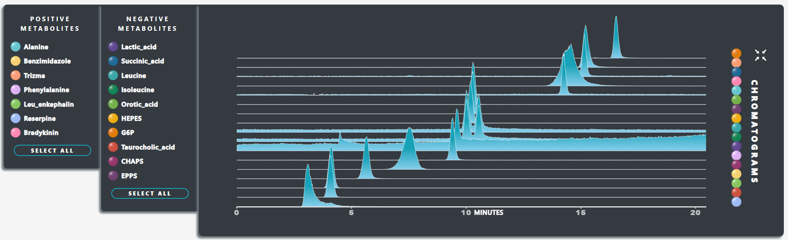  
  
__Ridge lines__ show the chromatograms of the selected components on one chart ordered by their expected retention time. The heights of the peaks are normalised by default.

#### User Interaction
- Click on any chromatogram to rescale the y-axis to that chromatogram. Click again to reset.
- Hover over an input component circle to highlight.
- Use the date controls to change the chromatograms.


### Chromatograms
  
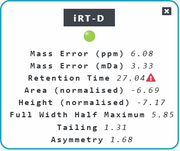
</br>
</br>

Click on a component name to view the __chromatogram__ for that component on the date shown. Chromatograms can also be updated from the charts when component nodes are clicked.

#### User Interaction
- Click and drag the chart area to focus. Double click to reset.
- Hover over a chromatogram to view a pop-up modal of all the metric readings for that component.
- When a chromatogram is clicked, the modal will remain open and will be updated.  
  


### Pressure Profiles (Thermo Scientific Only)
  
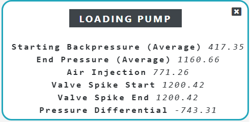
  
For Thermo Scientific instrumentation, a __pressure profile__ will be displayed at the top right of the page.

#### User Interaction
- Click and drag the chart area to focus. Double click to reset.
- Hover over a profile to view a pop-up modal of all the pressure metric readings.
- When a profile is clicked, the modal will remain open and will be updated.


## Help and Support
- Consult the __User Guides__ from the navigation menu for UI and common use cases.
	- https://youtu.be/_4T2WQHC5SY (Configuration)
	- https://youtu.be/wXOK1BTWMlE (Charts)
- __NOTE:__ The system creates its own check files (METABOLOMICS.txt, PROTEOMICS.txt) when processing. These can linger in the __mpmf-pipeline__ directory if processing is terminated early. Remove these from the directory before processing again.
